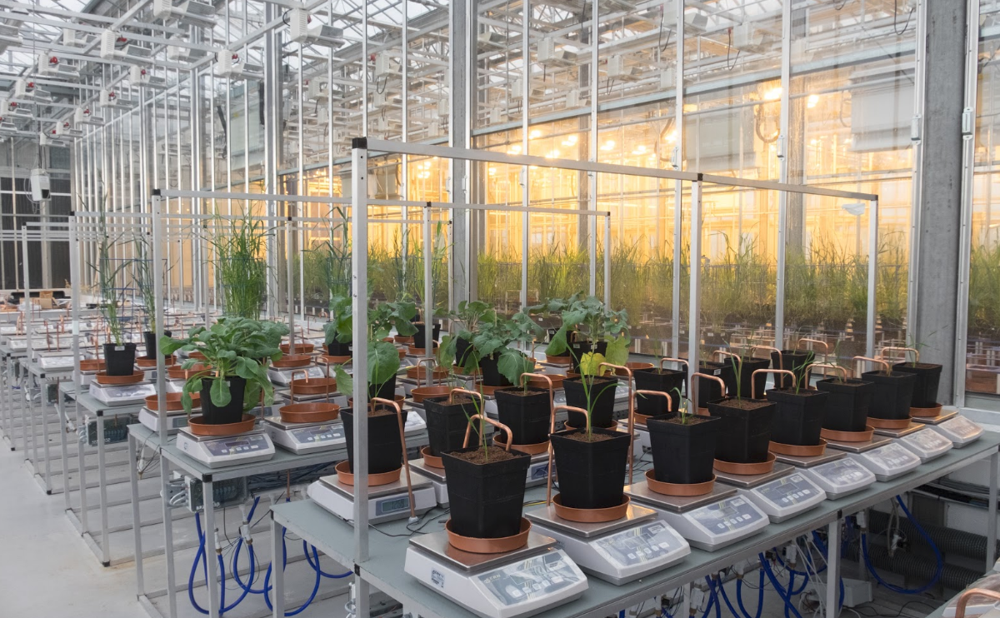
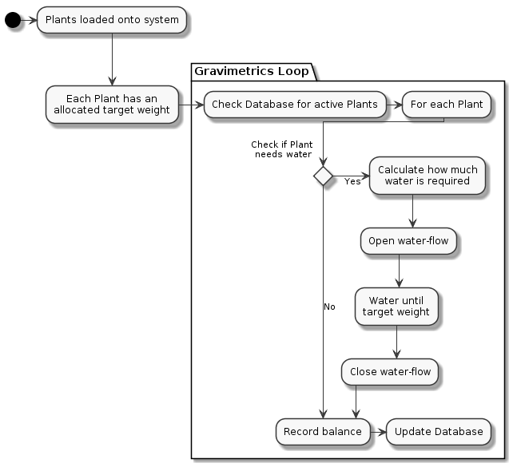

# What is a Gravimetrics phenotyping system?

This system is designed to enable the study of mass/weight change over time for a set or sets of plants. Additionally, the automatic watering and drought of plants are handled by this system.

By recording changes in weight at a minute-minute scale, plant behaviours can be accurately described, allowing for sophisticated and informative research to be undertaken.

Here, a full blueprint and implementation compendium for a plant phenotyping system is provided.

# What is provided?

While there exists commercial solutions to gravimetric plant phenotyping, none are provided as open-source solutions.

This project was designed and implemented at the National Plant Phenomics Centre in Aberystwyth, Wales, UK. Built from the ground up using widely available parts, allowing for adaption and scaling.

Designs for physical hardware components used, software for hardware interaction, databases and web interfaces are all provided.

# System Flow Diagram

The basic day-to-day flow is as such:

Additiona; interactions, such as updating weights or changing watering times/frequency is performed manually through the web interface.

# Components

Key components provided are:

## Hardware Interaction

A low-level unix C library named "GraviUtils" is used to interact with load-cells (balances) over a serial connection to a Raspberry Pi controller.

In addition to reading balance information for a series of load-cells, the utilities library controls and manages the watering of plants.

## System Design Documentation

## Raspberry Pi Setup

## Database Configuration

## Web Interface